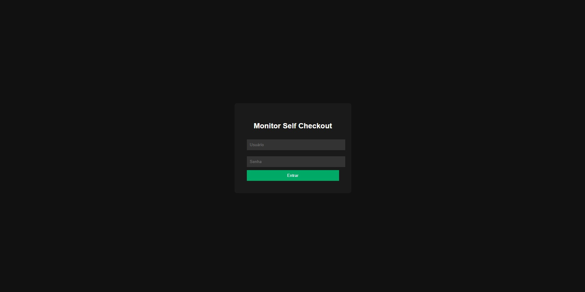
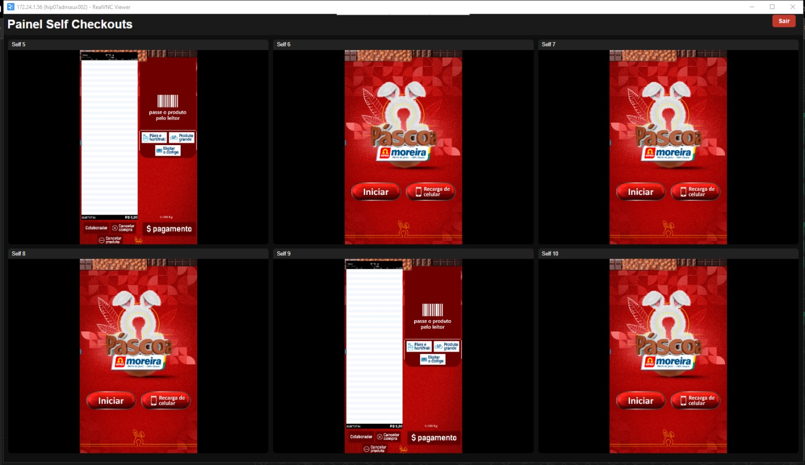

# Self-monitor - Tela monitoramento selfscheckout verticais
Painel de monitoramento de Self Checkouts via VNC.

## Funcionalidades

- Monitoramento simultâneo de múltiplos Self Checkouts
- Conexão VNC via navegador (noVNC)
- Login administrativo
- Reconexão automática
- Interface otimizada para telas grandes

## Tecnologias utilizadas

- Python
- Flask
- noVNC
- Websockify
- HTML / CSS / JavaScript

## Estrutura do projeto:
self-monitor

├── novnc

├── templates

├── server.py

├── iniciar_self_monitor.bat

└── README.md

## Como executar:

1-Instale Python.

2-Execute o arquivo:

iniciar_self_monitor.bat

## Login

## Painel de Monitoramento

Autor
## Phabrício Pedro Alves - 22 anos - Técnólogo da Informação - Desenvolevdor Backend/Frontend.
